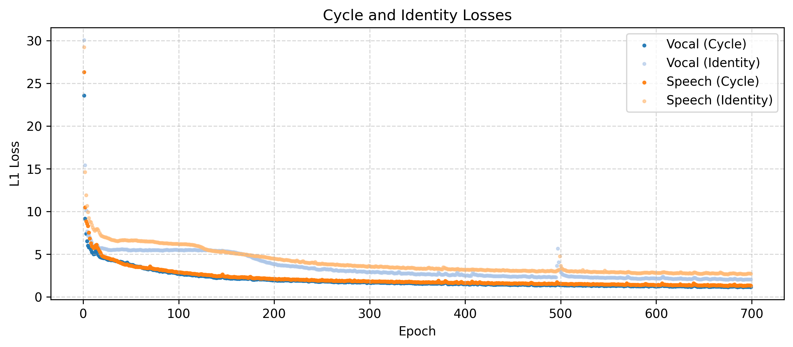

# spring_2025_dl_audio_project - VocalCycleGAN
Erdos deep learning bootcamp final project - Spring 2025

## Introduction
In this project, we implement a CycleGAN model to transform speech (along with an instrumental) into synthesized singing and transform singing into synthesized speech. The generators are implemented with [Wave-U-Net-Pytorch](https://github.com/f90/Wave-U-Net-Pytorch/tree/master) by Daniel Stoller, and the discriminators are implemented with [MINIROCKETPlus](https://timeseriesai.github.io/tsai/models.minirocketplus_pytorch.html). The speech data comes from [LibriSpeech](https://www.openslr.org/12), and the vocal/instrumental data is sourced from [MUSDB18](https://sigsep.github.io/datasets/musdb.html#musdb18-compressed-stems). We leveraged [Librosa](https://librosa.org/doc/latest/index.html#) for audio processing in Python.

## CycleGAN - Generators, Discriminators, and Losses
The model class VocalCycleGAN defined in vcgan.py is trained by a modified cycleGAN training loop. CycleGAN was introduced in 2017 by [Zhu-Park-Isola-Efros](https://junyanz.github.io/CycleGAN/) to transform between images in two different domains (for example turning images of horses to images of zebras and vice versa). In our cycleGAN framework, the two domains are singing and speech. Let us describe our cycleGAN loop in detail.

We have four neural networks in our training loop:
- generator_vocal : An instance of Wave-U-Net that accepts human speech and a clip of an instrumental track and attempts to generate a vocal performance.
- generator_speech : An instance of Wave-U-Net that accepts a vocal performance and attempts to generate human speech.
- discriminator_vocal : An instance of the MiniRocket discriminator that attempts to determine whether a given clip of audio is real singing or machine generated. 
- discriminator_speech : An instance of the MiniRocket discriminator that attempts to determine whether a given clip of audio is real speech or machine generated.

Both discriminators output a number between zero and one representing the probability that a sample is real. So the discriminator outputs smaller values when it thinks the sample is fake.

To train the discriminators, we minimize two loss functions:
- Binary cross entropy of the predictions of each generator.
- Adversarial loss : $\sum_x D(G(x))^2$ where $x$ is a piece of sample data, $D$ is the discriminator, and $G$ is the generator. Minimizing this encourages the discriminator to not be fooled by the generator.

To train the generators, we minimize three loss functions:
- Adversarial loss : In this case, adversarial loss is computed as $\sum_x (1-D(G(x)))^2$. Minimizing this function encourages the generator to fool the generator.
- Cycle loss : Ideally, if we feed a piece of data through both generators, it should not change. So we minimize the $\ell_1$ distance between a piece of data $x$ and $G_2(G_1(x))$ where $G_1,G_2$ are the generators. Note that order matters here: if $x$ is speech, $G_1$ is generator_vocal and $G_2$ is generator_speech.
- Identity loss : Ideally, generator_speech (resp. generator_vocal) would leave real speech (resp. singing) unchanged. So we minimize the $\ell_1$ mean-square error between $x$ and $G(x)$ where $G$ is generator_vocal if $x$ is singing and $G$ is generator_speech if $x$ is speech. There is an additional benefit to this loss function. Recall that generator_vocal acccepts a pair (speech, accompaniment) of speech and an instrumental accompaniment. The model must learn that it supposed to modify the speech to fit over the accompaniment. The identity loss indicates to the model that the speech is the primary object to operate on.

## Data

Our model is trained on two sources of data:
- The [MUSDB18](https://sigsep.github.io/datasets/musdb.html#musdb18-compressed-stems) dataset is a collection of 150 songs. Each song has seperate audio files for the vocal, bass, drums, and accompaniment (guitars, keys, synths, etc). From this dataset, we are able to separate vocals from their corresponding instrumental tracks.
- The [LibriSpeech](https://www.openslr.org/12) dataset contains 360 hours of human speech.

We package the MUSDB data in the MusdbDataset object and the LibriSpeech data in the LibriSpeechDataset object (both subclasses of the pytorch Dataset class). 

Handling raw audio data can be difficult for neural networks storing audio as a time series produces a very long tensor (44100 samples per second is typical). To work with smaller tensors, we compute a log mel spectrogram using [Librosa](https://librosa.org/doc/latest/index.html#). This involves three steps:
1) Chop the audio into small chunks and compute a Fourier transform. This gives us frequency information at each time step. (The number of time steps in our code is usually stored as window_size). This process is called the short time Fourier transform (STFT).
2) Take the absolute value of the complex numbers and project onto the [mel scale](https://en.wikipedia.org/wiki/Mel_scale). In our model, we use 128 mel bins.
3) Convert the values to db (this essentially amounts to taking a logarithm).
The result is a tensor of size (128, window_size). Notice that taking the absolute value of a complex number destroys the phase information. Thus, this process is not invertible. However, the [Griffin-Lim](https://librosa.org/doc/main/generated/librosa.griffinlim.html) algorithm approximates the phase information which allows us to convert spectrograms into audio. One could train a vocoder to approximate phase information to achieve a better conversion.

## Training
Before we trained our final model we tested the various loss parameters. The first model we trained had an adversarial loss weighted equally to the cycle loss. The result was a model that outputted silence.
Lowering the cycle loss by a factor of 1000 gave us a model that produced melodic tones with no discernable words. We then gave the identity loss the same weight as the cycle loss. The model left the speech unchanged. Decreasing the identity loss by a factor of 100 gave us clear words whose tone had been changed.
| Cycle Loss | Identity Loss |Generated Vocals                  |
|:--------------|:-----------|:-----------------------------------|
| 1             | 0           | silent                             |
| 0.001         | 0           | melodic tones, no words            |
| 0.001         | 0.001       | identical to input                 |
| 0.001       |    0.00001         |  words with tone changed        |

We trained for 700 epochs and got good behavour from our metrics.




## Files
- dataset_classes.py : Contains the class definitions of the MusdbDataset and LibriSpeechDataset classes. There are three other internal dataset classes (AccompanimentVocalData, Speech Data, AccompanimentData) that help with loading and shuffling the data in the training loop.
- download_datasets.py : Downloads the MUSDB and LibriSpeech data onto the user's machine.
- build_datasets_from_path.py : Contains a wrapper function around the class constructors. This allows the user to build the necessary datasets from only a path to the data.
- mrdiscriminator.py : Defines the TsaiMiniRocketDiscriminator class. Both discriminators are instances of this class.
- vcgan.py : Defines the VocalCycleGAN class. This is the model class with the training loop.
- app.py : Implements our Streamlit app.


## Warnings
1) To run this project, the user must install the python packages sktime, musdb, and stempeg.
2) In the course of the project, we found that installing stempeg using pip or conda resulted in errors. We opted to download the latest version of stempeg (available [here](https://github.com/faroit/stempeg/tree/master)). The musdb package automatically installs stempeg, so the user must uninstall it before importing stempeg locally. The following code should give the correct configuration if the stempeg code is available.
```
import sys
!{sys.executable} -m pip install musdb
!{sys.executable} -m pip uninstall -y stempeg
```
3) We have included a link to the Wave-U-Net github. Be sure that that module is available for import.
